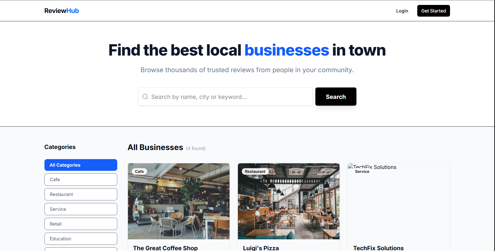
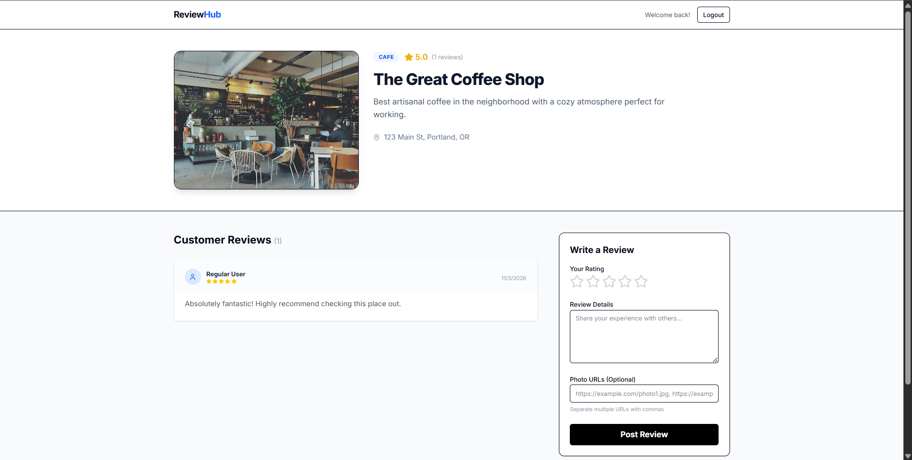
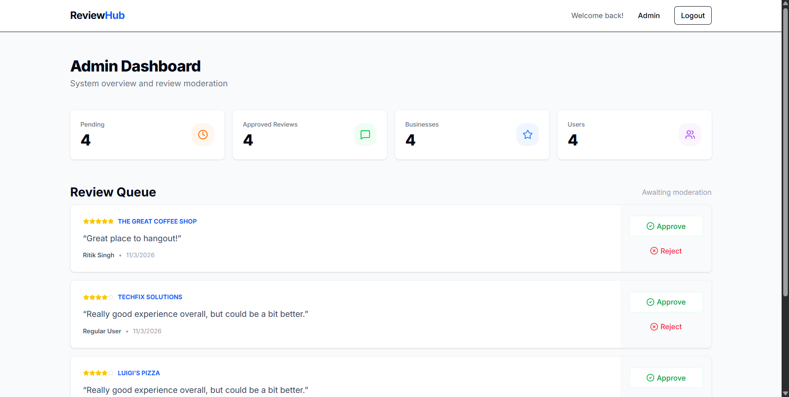

# Crowdsourced Review Platform


A full-stack web platform where users can **discover, review, and rate local businesses** such as restaurants, shops, and services.  
The system enables **community-driven reviews** while maintaining quality through an **admin moderation workflow**.

This project was built as part of the **Infinite Locus Assignment – Problem Statement C**.

---

# Problem Statement

Build a crowdsourced review platform where users can review and rate local businesses such as restaurants, shops, and services.

The platform should allow users to:

- Browse businesses by category
- Submit reviews
- Rate businesses on criteria like **quality, service, and value**

Admins should be able to:

- Approve or reject reviews before they are published.

---

# Key Requirements

### Frontend
- Interface for browsing businesses
- Review submission system
- Ratings display
- Search and filter options

### Backend
- User authentication
- Review submission workflow
- Review approval system
- Rating aggregation logic

### Database
Store:

- business information
- user profiles
- reviews
- ratings

### Bonus Features
- Photo uploads with reviews
- Admin dashboard

---

# Project Architecture

```
User (Browser)
      │
      ▼
Next.js Frontend (React + Tailwind)
      │
      ▼
Next.js Server Actions
      │
      ▼
Prisma ORM
      │
      ▼
SQLite / LibSQL Database
```

---

# Tech Stack

| Layer | Technology |
|------|-------------|
| Frontend | Next.js App Router |
| UI | React + TailwindCSS |
| Language | TypeScript |
| Backend | Next.js Server Actions |
| Database | SQLite / LibSQL |
| ORM | Prisma |
| Authentication | JWT |
| Validation | Zod |
| Styling utilities | clsx + tailwind-merge |

---

# Why TypeScript Was Used

TypeScript was chosen to improve **code quality, reliability, and scalability**.

### Static Type Safety
TypeScript detects errors during development instead of runtime.

Example benefits:
- prevents incorrect API usage
- prevents wrong database query inputs
- ensures consistent object structures

---

### Better Developer Experience

TypeScript provides:

- IntelliSense
- autocomplete
- error highlighting
- faster debugging

This significantly improves development productivity.

---

### Prisma Integration

Prisma automatically generates **TypeScript types from the database schema**, ensuring safe database queries.

Example:

```
const users = await prisma.user.findMany()
```

The return type is automatically inferred.

---

### Scalability

TypeScript allows the project to scale easily as more modules are added.

Without TypeScript, maintaining large projects becomes difficult due to runtime errors.

---

# Features

| Feature | Description |
|-------|-------------|
| User Authentication | Secure login and signup |
| Business Listings | Browse businesses by category |
| Review Submission | Users can post reviews |
| Rating System | Rate businesses on multiple criteria |
| Admin Moderation | Reviews must be approved before publishing |
| Search & Filtering | Find businesses easily |
| Responsive UI | Built using TailwindCSS |

---

# Project Structure

```
infinite_locus_assignment
│
├── prisma
│   ├── schema.prisma
│   └── seed.ts
│
├── src
│   ├── actions
│   ├── app
│   ├── components
│   └── lib
│       ├── prisma.ts
│       ├── auth.ts
│       ├── session.ts
│       └── utils.ts
│
├── public
├── package.json
├── tsconfig.json
└── README.md
```

---

# Installation & Setup

### 1 Clone the repository

```
git clone https://github.com/GLITCHINvision/infinite_locus_assignment.git
cd infinite_locus_assignment
```

---

### 2 Install dependencies

```
npm install
```

---

### 3 Create environment variables

Create a `.env` file in the root directory.

```
DATABASE_URL="file:./dev.db"
JWT_SECRET="your-secret-key"
```

---

### 4 Generate Prisma Client

```
npx prisma generate
```

---

### 5 Sync Database

```
npx prisma db push
```

---

### 6 Run development server

```
npm run dev
```

Open:

```
http://localhost:3000
```

---

# Database Design

The database contains the following main entities:

- Users
- Businesses
- Reviews
- Ratings

Relationships:

```
User → Reviews
Business → Reviews
Reviews → Ratings
```

Prisma ORM manages database queries and schema migrations.

---

# Challenges Faced

### 1 Prisma Database Configuration

Initially, Prisma could not connect to the database because the `DATABASE_URL` environment variable was missing.

This caused runtime errors until the `.env` file was configured correctly.

---

### 2 Prisma Client Generation

The Prisma client must be generated before running the project.

Without running:

```
npx prisma generate
```

the application throws import errors.

---

### 3 Environment Variables

Since `.env` files are ignored by Git, new developers cloning the repository may encounter configuration issues.

This required manual environment setup.

---

### 4 Authentication Implementation

Managing authentication securely required:

- hashing passwords using bcrypt
- creating JWT tokens
- managing secure cookies

---

### 5 Next.js Server Actions

Integrating backend logic with the frontend using **Server Actions** required understanding how Next.js handles server-side execution.

---

# Future Improvements

Potential improvements for the platform:

- Image uploads for reviews
- Location-based search
- Google Maps integration
- Advanced rating analytics
- Admin analytics dashboard
- Notifications for review approval

---

# Screenshots


```
Admin Id : admin@example.com
Admin Password : admin123
```




# License

This project is for educational purposes.
